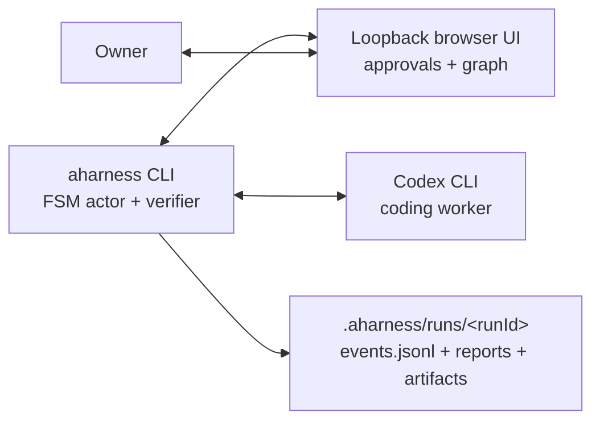

<div align="center">

# aharness

**Make coding-agent workflows executable.**

aharness wraps Codex in a finite-state workflow: plans must be submitted,
approvals must happen, tests must produce evidence, repair loops must run, and
final reports only happen after the machine says they can.

[](LICENSE)
[](package.json)
[](packages/core/SUPPORTED_CODEX.md)

</div>

Skills tell an agent what to do. aharness makes sure the process actually
happens.

Use aharness when a coding task needs more structure than a prompt and less
infrastructure than a custom agent platform. Codex still does the language,
tool, and code work; aharness owns the workflow around it: states, transitions,
typed submissions, approvals, hooks, repair loops, and run artifacts.

## Why aharness

Long-horizon coding work fails in boring ways. The model skips a planning gate.
It starts implementing before approval. It says tests passed without producing
the evidence you wanted. It exits early because the prompt asked for a final
summary and the model decided the process was "close enough."

aharness turns those process rules into executable state machines:

- **Gates are real.** If a state does not expose an implementation exit, the
  model cannot move to implementation.
- **Evidence is typed.** The model submits structured payloads that aharness
  validates before reducers, guards, or effects run.
- **Approvals are controlled.** Owner input and permission requests route
  through aharness instead of relying on model convention.
- **Repair loops are explicit.** Failed evidence can transition to repair,
  rerun checks, and only then continue.
- **Runs are inspectable.** Every run writes a canonical `events.jsonl`
  transcript, terminal reports, and declared artifacts under
  `.aharness/runs/<runId>/`.

## The Middle Layer

| Approach | Best for | Where it breaks down |
| --- | --- | --- |
| Skills and prompts | Reusable guidance and local conventions | Advisory only; the model can drift, skip gates, or rationalize missing evidence |
| General agent frameworks | Broad agent graphs and application orchestration | Usually not focused on Codex coding runs, local approvals, and typed coding-task gates |
| Custom coding frameworks | Deeply owned internal platforms | You own the runtime, UI, verifier, approval routing, logs, packaging, and maintenance |
| aharness | Enforced coding workflows around Codex | Overkill for one-shot prompts and tiny edits |

aharness can load skills, but the FSM owns the process. It gives you the
control plane you would otherwise build yourself, scoped specifically to
coding-agent workflows.

## Install

Prerequisites:

- Node.js `>=20`
- Codex CLI `>=0.130.0`

```bash
npm install --save-dev @aharness/core
```

## Quickstart

Scaffold a starter FSM project:

```bash
npx aharness init --dir my-fsm
cd my-fsm
npm start
```

Or run an existing FSM directly:

```bash
npx aharness verify ./workflow.fsm.ts
npx aharness visualize ./workflow.fsm.ts
npx aharness ./workflow.fsm.ts
```

`verify` checks the machine before any model run. `visualize` opens the browser
graph without starting Codex. Running the FSM starts Codex, opens the aharness
UI, shows compact JSONL-backed transcript rows plus aggregate running-time,
token, and context-window stats in the header and bottom status bar, and writes
run artifacts under `.aharness/runs/<runId>/`. Internal aharness submit calls
stay out of the default transcript.

New runs write a canonical `events.jsonl` transcript under the run directory.
That file includes full raw runtime payloads by default, including
secret-marked owner input, browser reply bodies, tool arguments/results,
command output, file diffs, approval/permission/elicitation data, and token
usage payloads, plus parent-visible sub-thread notifications. Treat run
directories as sensitive. The loopback UI server also exposes run-scoped
JSONL-backed endpoints for the active run: `/api/runs/:runId/bootstrap`,
`/api/runs/:runId/visits/:visitId/rows`, `/api/runs/:runId/rows/recent`,
`/api/runs/:runId/events`, `/api/runs/:runId/stream`, and
`/api/runs/:runId/reply`. These API/SSE projections are compact and omit raw
payload expansion; inspect `events.jsonl` directly only when that sensitive raw
evidence is needed. The React browser now boots, streams rows/events, and sends
replies through those run-scoped endpoints. Browser chrome is no longer centered
on a top turn count or bottom turn ribbon; it renders aggregate run duration,
token, and context stats when those values are available. The old flat
`/api/state`, `/api/stream`, and `/api/reply` browser routes are no longer
served for new runs. `snapshot.json` is not written by production live runs and
is not a new-run UI/history/replay source; retained snapshot helper exports are
legacy/internal compatibility only.

## Write A Workflow

aharness workflows are TypeScript files built with `createFsm`:

```ts
import { createFsm } from '@aharness/core';

interface Data {
  plan: string | null;
}

const fsm = createFsm<Data>();

export default fsm.machine({
  id: 'tiny-coding-task',
  initial: 'plan',
  data: () => ({ plan: null }),
  states: {
    plan: fsm.state({
      prompt:
        'Inspect the requested coding task, write a short implementation plan, ' +
        'then submit it as { "plan": "..." }.',
      on: {
        submitPlan: fsm.submit<{ plan: string }>({
          to: 'ownerApproval',
          reduce: (draft, payload) => {
            draft.plan = payload.plan;
          },
        }),
      },
    }),
    ownerApproval: fsm.state({
      prompt: (data) =>
        `Ask the owner to approve this plan before implementation:\n\n${data.plan}`,
      on: {
        approved: fsm.await({
          ask: 'Approve this plan? Reply with approval or requested changes.',
          to: 'done',
        }),
      },
    }),
    done: fsm.final({ outcome: 'success' }),
  },
});
```

The model can write text, run tools, and edit files while a state is active.
The FSM decides which structured exits are available and what happens when one
is submitted.

## Demo

Start with the coding smoke demo:

- [`examples/coding-smoke.fsm.ts`](examples/coding-smoke.fsm.ts) runs a tiny
  TypeScript fixture through planning, owner approval, implementation, tests,
  repair on failure, and final reporting.
- [`examples/coding-smoke/README.md`](examples/coding-smoke/README.md)
  explains the fixture and run command.

Then use the mechanism demos as references:

- [`examples/README.md`](examples/README.md) gives the recommended examples
  path.
- [`examples/DEMOS.md`](examples/DEMOS.md) catalogs await exits, approval
  hooks, composition, skill loading, branching, state model settings, and final
  artifacts.

## State Model Settings

Use `model` on a state to control model and effort:

```ts
implementation: fsm.state({
  model: {
    name: 'gpt-5.1-codex',
    effort: 'high',
  },
  prompt: 'Implement the approved plan and submit test evidence.',
  on: {
    implemented: fsm.submit<{ testsPassed: boolean }>({ to: 'review' }),
  },
});
```

Either `name` or `effort` (or both) is required:

```ts
modelOnly: fsm.state({
  model: { name: 'gpt-5.1-codex' },
  prompt: 'Review the change with the selected model.',
});

effortOnly: fsm.state({
  model: { effort: 'high' },
  prompt: 'Review the change with higher reasoning effort.',
});
```

Use `model` declarations to route non-clear state transitions through sticky thread
settings. A non-clear state that omits `model` keeps the previous effective
model and effort:

```ts
lowModelStep: fsm.state({
  model: { effort: 'minimal' },
  prompt: 'Read and summarize the codebase with low effort.',
  on: {
    summarized: fsm.submit<{ summary: string }>({ to: 'normalModelStep' }),
  },
});

normalModelStep: fsm.state({
  // No model => still uses minimal reasoning effort from lowModelStep.
  prompt: 'Continue with normal workflow from the current model state.',
  on: {
    continued: fsm.submit<{ finished: boolean }>({ to: 'review' }),
  },
});
```

Set a state-level model override on a clear-fresh transition by pairing it with
`clearOnEntry`:

```ts
worktreeReview: fsm.state({
  clearOnEntry: { cwd: '/absolute/path/to/worktree' },
  model: { name: 'gpt-5.1-codex', effort: 'high' },
  prompt: 'Review this worktree and submit findings.',
  on: {
    reviewed: fsm.submit<{ findings: string }>({ to: 'done' }),
  },
});
```

Effort-only with clear fresh-fresh behavior:

```ts
worktreeReview: fsm.state({
  clearOnEntry: true,
  model: { effort: 'high' },
  prompt: 'Review and summarize before the next phase.',
  on: {
    reviewed: fsm.submit<{ findings: string }>({ to: 'done' }),
  },
});
```

`clearOnEntry` is now freshness-only:

- `clearOnEntry: true` starts the target state in a replacement thread with the
  launch CWD.
- `clearOnEntry: { cwd: '/absolute/path' }` starts in a replacement thread at that
  path.
- `clearOnEntry: { cwd: (data) => data.packageDir }` resolves CWD from context.

`clearOnEntry` and `model` are each independently validated by the verifier:

- `clearOnEntry` checks validate `cwd` shape and existence.
- `model.name` values are checked against Codex `model/list` and
  `model/list({ includeHidden: true })` where possible.
- `model.effort` must be one of `none`, `minimal`, `low`, `medium`, `high`, or
  `xhigh`; it is validated by runtime when model lookup depends on active state.

`clearOnEntry` only controls thread replacement and working directory; it does
not clear sticky model/effort settings. If a later non-clear state omits `model`,
the previous effective model/effort remains active.

## CLI

```bash
aharness [--yolo] <file.fsm.ts> [--<flag> <value>]...
aharness visualize <file.fsm.ts> [--<flag> <value>]...
aharness verify <file.fsm.ts>
aharness doctor
aharness init --dir <path> [--force] [--no-git] [--no-install] [--pm <npm|pnpm|yarn|bun>]
aharness install <source>
aharness run [--yolo] <command> [--<flag> <value>]...
aharness list
aharness uninstall <package-name>
aharness verify <package-name>
aharness verify <package-name>/<command-name>
aharness completion install [--shell bash|zsh|fish]
aharness completion uninstall
```

Machine inputs become kebab-case flags, so `fixtureRoot` becomes
`--fixture-root`.

`aharness completion install` uses `@pnpm/tabtab`; the installed shell delegate
calls the hidden `aharness completion-server` bridge on each Tab press. Bare
`aharness completion` remains a compatibility alias for the same bridge. Before
an FSM path is resolved, completion delegates to the shell's file completion;
after an FSM path is resolved, it suggests that FSM's input flags and supported
flag values.

`--yolo` is a dangerous live-runtime flag for direct FSM runs and installed
command runs. It starts Codex with `approval_policy="never"` and
`sandbox_mode="danger-full-access"`, mirroring Codex's dangerous bypass mode.
It is not available for non-live subcommands such as `verify`, `visualize`,
`doctor`, `install`, `list`, `uninstall`, or `completion`. For direct runs it
may appear before or after the FSM path; for installed commands it may appear
before or after the command name.

## How It Works



At runtime, aharness verifies the FSM, starts one Codex `app-server` child
process, connects as the sole WebSocket client for that run, and hosts the
XState actor in-process. Codex performs the work; aharness controls the
transition surface.

Owner replies, permission requests, hooks, typed submissions, and final
artifacts all pass through the active FSM state. The browser UI shows the graph,
compact run rows, aggregate run stats, and handles approvals through a per-run
loopback token.

## Packages

- [`@aharness/core`](packages/core/README.md) provides the SDK and `aharness`
  CLI binary.
- [`@aharness/test-support`](packages/test-support/README.md) provides
  integration-test fixtures for aharness runs.
- [`@aharness/superpowers`](packages/superpowers/README.md) is an example
  reusable FSM package.

Reusable FSM packages are npm-shaped packages with explicit
`aharness.package.commands` entries. Install them through npm-backed aharness
state, then run their commands through the global CLI:

```bash
aharness install @scope/tools
aharness run @scope/tools/build
```

Command entries point at package-root-relative `.fsm.ts` files and are verified
before aharness writes trusted install records. If validation fails after npm
changes the managed package tree, unverified commands are not indexed; see
[`docs/troubleshooting.md`](docs/troubleshooting.md) for recovery and lock
fingerprint mismatch guidance.

## Documentation

- [`docs/authoring.md`](docs/authoring.md) teaches the coding-workflow mental
  model.
- [`docs/reference.md`](docs/reference.md) documents the public SDK and CLI.
- [`docs/architecture.md`](docs/architecture.md) explains the Codex/aharness
  runtime boundary.
- [`docs/troubleshooting.md`](docs/troubleshooting.md) covers prerequisite and
  runtime failures.
- [`CONTRIBUTING.md`](CONTRIBUTING.md), [`CHANGELOG.md`](CHANGELOG.md), and
  [`SECURITY.md`](SECURITY.md) cover project maintenance, release notes, and
  vulnerability reporting.

## License

Apache-2.0. See [`LICENSE`](LICENSE).
