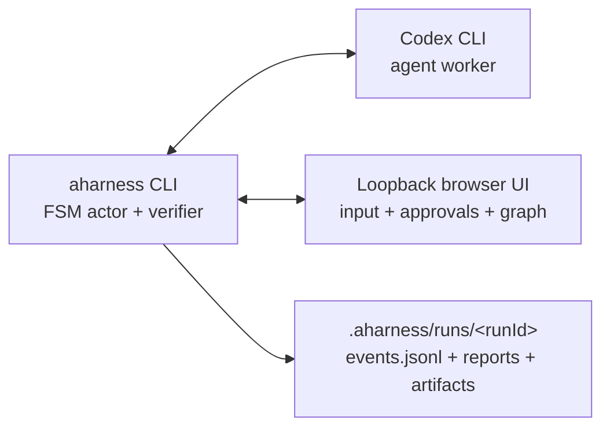

<!-- Generated from the repository root README.md by scripts/sync-package-readmes.mjs. Do not edit by hand. -->

<div align="center">

# aharness

**Make agent workflows executable.**

The workflow harness for Codex: typed gates, validated evidence, controlled
transitions, repair paths, and inspectable run logs for any workflow.

[](https://github.com/Alfredvc/aharness/blob/main/LICENSE)
[](https://github.com/Alfredvc/aharness/blob/main/package.json)
[](https://github.com/Alfredvc/aharness/blob/main/packages/core/SUPPORTED_CODEX.md)

</div>

## Hypothesis

Agents are now capable enough for long, multi-step work, but the main failure
mode has shifted from task ability to process drift: skipping approval,
forgetting recovery rules, claiming evidence that was not produced, or
continuing from stale context.

Prompts and skills can describe the process, but they cannot enforce it.
aharness turns the process into a runtime: states define what Codex may do next,
typed submissions prove what happened, and transitions only occur through
validated exits.

The bet is that useful workflows are reusable software. They should be authored,
reviewed, versioned, composed from smaller FSMs, and published as npm packages
instead of copied around as prompts.

## What You Get

- **Enforced workflow gates.** Codex can only leave a state through exits the
  FSM exposes. If execution is not a valid next step, the model cannot
  transition there by narration.
- **Typed transitions and evidence.** Model submissions go through
  `fsm.submit<T>()`, schema validation, reducers, guards, and effects before the
  workflow advances.
- **Fresh context and model control.** Each state can choose the Codex model,
  effort level, and whether to start in a fresh thread or working directory with
  `clearOnEntry`.
- **Reusable workflow packages.** FSMs can ship as npm packages with
  `aharness.package.commands`, bundled skills, and package-relative assets, then
  run as installed aharness commands.
- **Hierarchical composition.** Larger workflows can embed smaller FSMs with
  `fsm.embed(...)`, including reusable child workflows distributed through
  packages.
- **Owner and policy control.** Owner choices, permission requests, pre-tool
  hooks, post-tool hooks, and prompt-submission events can become explicit FSM
  transitions.
- **State-scoped skills.** Skills guide Codex inside a state, while the FSM owns
  process control, valid exits, recovery paths, and terminal outcomes.
- **Inspectable runs.** Every run writes durable event logs, state history,
  artifacts, and recorded browser views so the workflow can be audited after the
  fact.

## Install

Prerequisites:

- Node.js `>=20`
- Codex CLI on `PATH`; see
  [`packages/core/SUPPORTED_CODEX.md`](https://github.com/Alfredvc/aharness/blob/main/packages/core/SUPPORTED_CODEX.md) for
  the current compatibility gate

```bash
npm install -g @aharness/core
```

The global install puts the `aharness` command on `PATH`. Scaffolded projects
still get local authoring dependencies so editors and `tsc` can typecheck FSM
source.

If setup fails, run:

```bash
aharness doctor
```

`doctor` checks the Codex CLI version gate and reports active run health.

## Quickstart

Start with Codeflow to turn a large implementation roadmap into reviewed,
verified, committed slices. It is the packaged aharness workflow for changes
that are too broad or risky for one implementation plan.

Install the [`@aharness/codeflow`](https://www.npmjs.com/package/@aharness/codeflow)
workflow package through aharness:

```bash
aharness install @aharness/codeflow
```

Then run its recipe-driven development command against an implementation
roadmap in your repository:

```bash
aharness run recipe-driven-development --roadmap-path docs/plans/my-roadmap.md
```

The Codeflow package also ships process skills for preparing the roadmap:
`writing-ideas`, `grill-me`, `writing-specs`, `reviewing-specs`, and
`writing-implementation-roadmaps`. See the
[`Alfredvc/codeflow`](https://github.com/Alfredvc/codeflow) repository for docs
and more information.

## Contents

- [Writing Workflows](#writing-workflows)
- [Installing FSM Packages](#installing-fsm-packages)
- [Try The Demo](#try-the-demo)
- [How It Works](#how-it-works)
- [When To Use It](#when-to-use-it)
- [Common Commands](#common-commands)
- [Packages](#packages)
- [Documentation](#documentation)
- [FAQ](#faq)

## Writing Workflows

Author workflows with the bundled aharness FSM authoring skill, not from a
blank TypeScript file. The skill guides Codex through state design, typed exits,
owner choices, recovery paths, verification, and current `@aharness/core` API
rules.

Install the authoring skill with `npx skills`:

```bash
npx skills add Alfredvc/aharness
```

Then ask Codex to use it:

```text
Use $aharness-fsm-authoring to design and author an aharness FSM for this workflow.
```

The skill lives at
[`skills/aharness-fsm-authoring`](https://github.com/Alfredvc/aharness/blob/main/skills/aharness-fsm-authoring/SKILL.md). Under
the hood, generated workflows are TypeScript files built with `createFsm`,
`fsm.state`, `fsm.submit`, `fsm.choice`, and `fsm.final`; see
[`docs/authoring.md`](https://github.com/Alfredvc/aharness/blob/main/docs/authoring.md) when you need the API details.

A small FSM looks like this:

```ts
import { createFsm } from '@aharness/core';

interface Data {
  plan: string | null;
}

const fsm = createFsm<Data>();

export default fsm.machine({
  id: 'tiny-approval-workflow',
  initial: 'plan',
  data: () => ({ plan: null }),
  states: {
    plan: fsm.state({
      prompt:
        'Inspect the requested work, write a short plan, ' +
        'then submit it as { "plan": "..." }. Do not edit files yet.',
      on: {
        submitPlan: fsm.submit<{ plan: string }>({
          to: 'ownerApproval',
          reduce: (draft, payload) => {
            draft.plan = payload.plan;
          },
        }),
      },
    }),
    ownerApproval: fsm.choice({
      question: (data) => `Approve this plan before continuing?\n\n${data.plan}`,
      options: [{ label: 'Approve', to: 'done' }],
    }),
    done: fsm.final({ outcome: 'success' }),
  },
});
```

## Installing FSM Packages

Published workflows are normal npm packages with aharness command metadata.
Install them through the global CLI:

```bash
aharness install workflow-package
aharness list
aharness verify build
aharness run build --project ./app
```

`aharness install <source>` accepts package specs npm accepts: registry
packages, versions or dist-tags, GitHub repos, git URLs, local directories, and
tarballs.

```bash
aharness install workflow-package@latest
aharness install github:owner/workflows
aharness install git+https://github.com/owner/workflows.git
aharness install ../workflows
aharness install ./workflows-1.0.0.tgz
```

During install, aharness lets npm materialize the package in its managed npm
project, then validates package command metadata, package-relative assets,
bundled skill declarations, and every declared FSM before writing trusted
command records. Installs may run npm lifecycle scripts, so install packages
from sources you trust. Unverified commands are not runnable.

Installed commands can be run or verified by fully qualified command identity,
or by bare command name when there is no collision. Package names by themselves
are not accepted verification targets:

```bash
aharness run workflow-package/build
aharness run build
aharness verify workflow-package/build
aharness verify build
```

Remove a package by package identity, not by command name:

```bash
aharness uninstall workflow-package
```

Re-run `aharness install <same-source>` to refresh a package after a new npm
version, Git ref, tarball, or local snapshot is available.

## Try The Demo

After installing the global CLI, clone this repository so the demo FSM and
fixture files are available:

```bash
git clone https://github.com/Alfredvc/aharness.git
cd aharness
aharness verify examples/coding-smoke.fsm.ts
aharness run examples/coding-smoke.fsm.ts
```

The demo files are:

- [`examples/coding-smoke.fsm.ts`](https://github.com/Alfredvc/aharness/blob/main/examples/coding-smoke.fsm.ts) - the FSM.
- [`examples/coding-smoke/fixture`](https://github.com/Alfredvc/aharness/tree/main/examples/coding-smoke/fixture) - the tiny
  broken TypeScript fixture the agent repairs.
- [`examples/coding-smoke/README.md`](https://github.com/Alfredvc/aharness/blob/main/examples/coding-smoke/README.md) - what
  to watch during the run.

After that, use [`examples/DEMOS.md`](https://github.com/Alfredvc/aharness/blob/main/examples/DEMOS.md) as a catalog of focused
mechanism demos for awaits, approvals, hooks, composition, skills, branching,
and final artifacts.

## How It Works



An aharness run has three jobs:

1. **Verify the workflow before Codex starts.** Invalid FSMs fail early, before
   the model can begin work.
2. **Keep Codex inside the active state.** aharness tells Codex the current
   state, valid exits, and required submit schema. Codex does the work;
   aharness validates submitted evidence and decides the next state.
3. **Record the run.** Every run writes canonical artifacts under
   `.aharness/runs/<runId>/`, including the event log, state history, final
   artifacts, and data used by the browser view.

The browser UI is the live operator surface. It shows the current state, graph,
compact transcript, approvals, and owner-input controls. Use `--no-open` when
you want aharness to serve and print the URL without opening a browser window.

Recorded inspection uses `aharness view [run-id]`. It reopens a completed run
from `.aharness/runs` without starting Codex or resuming the workflow. Omit the
run id to inspect the newest recorded run.

Run directories are sensitive. They can contain raw owner input, browser
replies, tool arguments and results, command output, file diffs, approvals,
token usage, and workflow context snapshots. Treat `.aharness/runs` as private
runtime evidence, not as a sanitized transcript.

## When To Use It

aharness is the middle layer for workflows that need more enforcement than a
prompt and less infrastructure than a custom agent platform.

| Use | Better fit |
| --- | --- |
| Ordered phases: plan, approve, execute, verify, repair, report | One-shot prompts and tiny edits |
| Typed submissions and required evidence | Manual sessions where the owner steers every turn |
| Owner approvals and policy hooks | General unconstrained agent orchestration |
| Reusable workflows packaged as commands | Teams ready to build and own a full custom runtime |

The core package provides mechanisms, not one team's process. Workflow opinions
belong in your FSMs, examples, or installable FSM packages.

## Common Commands

```bash
aharness init --dir <path>
aharness verify <file.fsm.ts|command>
aharness visualize <file.fsm.ts|command>
aharness run <file.fsm.ts|command> --help
aharness run [--ask|--yolo] [--no-open] <file.fsm.ts|command> [--<input-flag> <value>]...
aharness view [run-id]
aharness doctor
aharness install <source>
```

See [`docs/reference.md`](https://github.com/Alfredvc/aharness/blob/main/docs/reference.md) for the full CLI, state options,
hooks, installable package commands, completions, default Codex auto-review
behavior, `--ask`, `--yolo`, and `--no-open`.

## Packages

- [`@aharness/core`](https://github.com/Alfredvc/aharness/blob/main/packages/core/README.md) provides the SDK, the `aharness`
  CLI binary, and the `aharness-completion` shell-completion helper binary.
- [`@aharness/test-support`](https://github.com/Alfredvc/aharness/blob/main/packages/test-support/README.md) provides
  integration-test fixtures for aharness runs.
- `packages/web-ui` is the private React/Vite browser UI bundled into the core
  CLI build.

## Documentation

- [`docs/authoring.md`](https://github.com/Alfredvc/aharness/blob/main/docs/authoring.md) teaches the workflow authoring
  mental model.
- [`docs/reference.md`](https://github.com/Alfredvc/aharness/blob/main/docs/reference.md) documents the public SDK and CLI.
- [`docs/architecture.md`](https://github.com/Alfredvc/aharness/blob/main/docs/architecture.md) explains the Codex/aharness
  runtime boundary.
- [`docs/troubleshooting.md`](https://github.com/Alfredvc/aharness/blob/main/docs/troubleshooting.md) covers prerequisite and
  runtime failures.
- [`packages/core/SUPPORTED_CODEX.md`](https://github.com/Alfredvc/aharness/blob/main/packages/core/SUPPORTED_CODEX.md)
  documents the Codex CLI compatibility gate.
- [`CONTRIBUTING.md`](https://github.com/Alfredvc/aharness/blob/main/CONTRIBUTING.md), [`CHANGELOG.md`](https://github.com/Alfredvc/aharness/blob/main/CHANGELOG.md), and
  [`SECURITY.md`](https://github.com/Alfredvc/aharness/blob/main/SECURITY.md) cover project maintenance, release notes, and
  vulnerability reporting.

## FAQ

- __How is this different from Claude Code Dynamic Workflows__: Both try to solve the same issue: agents lack determinism. The approach is different. Dynamic workflows are generated on the fly by Claude Code itself. Aharness FSMs are long-lived workflows that are iterated on and improved over time. Aharness also supports single-use FSMs, but that is not the main use case.

- __Why Codex__: This project was originally based on Claude Code, but Claude Code is closed source and changes often. That made it difficult to develop aharness while keeping up with upstream changes. Codex is open source, and its app-server split makes building on top of it much easier.

- __When should I use aharness instead of a normal Codex session__: Use aharness when the process matters enough to enforce states, approvals, typed evidence, recovery paths, and terminal outcomes. For tiny one-shot edits or fully owner-steered sessions, a normal Codex session is usually simpler.

- __Does aharness replace Codex__: No. Codex still does the language, code, and tool work. Aharness owns the workflow boundary around that work: active states, valid exits, schema validation, owner choices, approval routing, hooks, transitions, and durable run evidence.

- __Will you ever support Claude Code or PI__: It depends on traction. This is currently an experiment, and it is already useful to me in its current form.

- __Can I run many FSMs simultaneously from one single UI__: Not yet. This also depends on traction. The long-term idea is to support `aharness submit X` together with a daemon that executes FSMs in the background. All UI <-> aharness communication is HTTP-based, so a local daemon could talk to a remote UI, or vice versa.

- __Can I share workflows with a team__: Yes. Workflows can be shipped as npm packages with aharness command metadata, bundled skills, and package-relative assets. Install packages only from sources you trust, because npm lifecycle scripts may run during `aharness install`.

- __Do I have to hand-write FSMs__: No. The intended authoring path is to use the bundled aharness FSM authoring skill with Codex, then use the docs as API reference when you need exact details.


## License

Apache-2.0. See [`LICENSE`](https://github.com/Alfredvc/aharness/blob/main/LICENSE).
